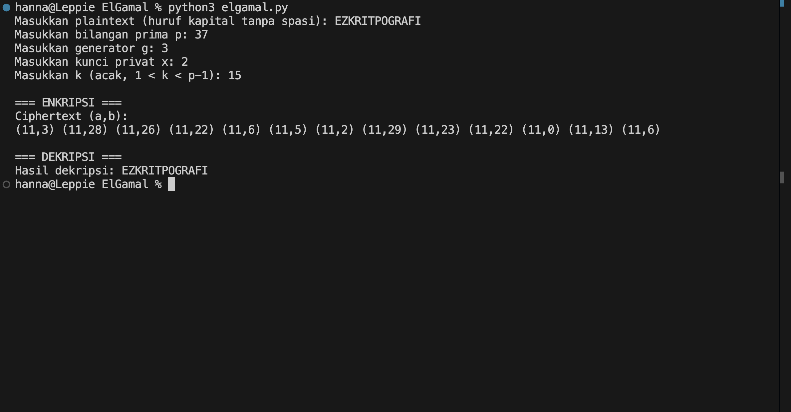

# ElGamal

Program ini merupakan program untuk enkripsi, dekripsi, dan mencari kunci Hill Cipher

## Alur Program 
1. User input plaintext + kunci (`p, g, x, k`).  
2. Enkripsi → ubah teks ke angka, hitung `(a, b)`.  
3. Dekripsi → hitung invers, ubah angka balik ke teks.  
4. Output ciphertext `(a, b)` dan plaintext hasil dekripsi. 

## Screenshot Program
Hasil Run

