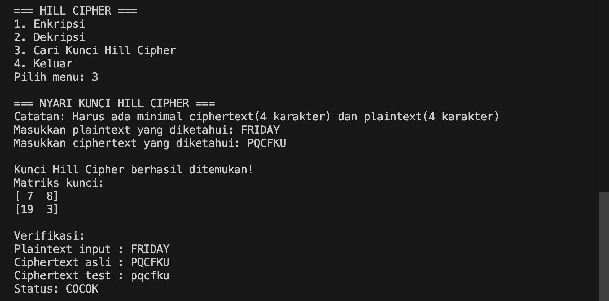
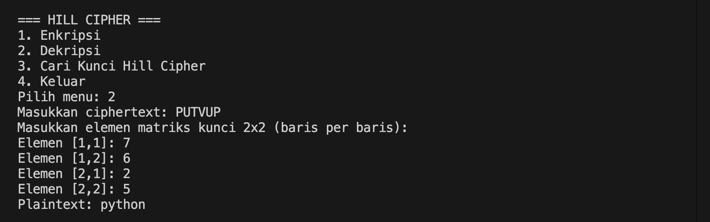
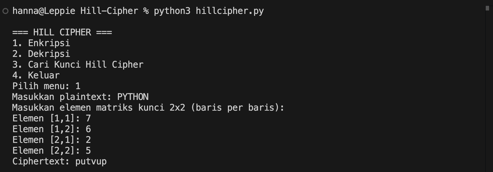

# Hill Cipher

Program ini merupakan program untuk enkripsi, dekripsi, dan mencari kunci Hill Cipher

## Alur Program 
User pilih menu :  
(1) Enkripsi → input plaintext + kunci → hasil ciphertext  
(2) Dekripsi → input ciphertext + kunci → hasil plaintext  
(3) Cari Kunci → input plaintext + ciphertext → hasil matriks kunci  
(4) Keluar → program selesai

## Screenshot Program
Hasil run dari setiap fitur
### Enkripsi

### Dekripsi 

### Kunci Hill Cipher

