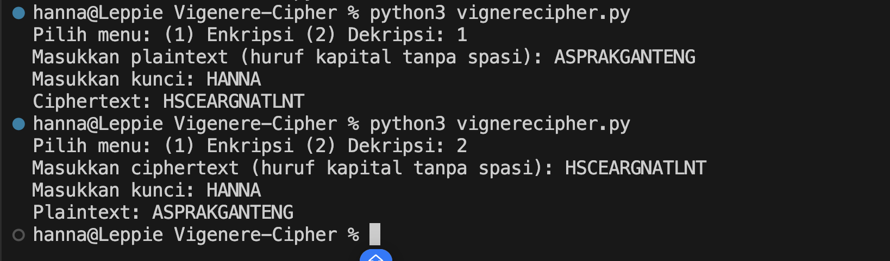

# Vignere Cipher

Program ini merupakan program untuk enkripsi dan dekripsi Vignere Cipher

## Alur Program 
1. User pilih menu: Enkripsi / Dekripsi.  
2. Input teks (plaintext/ciphertext) dan kunci.  
3. Proses:  
   - Enkripsi → geser huruf plaintext sesuai kunci.  
   - Dekripsi → geser balik huruf ciphertext sesuai kunci.  
4. Output teks hasil enkripsi atau dekripsi.  

## Screenshot Program
Hasil Run

